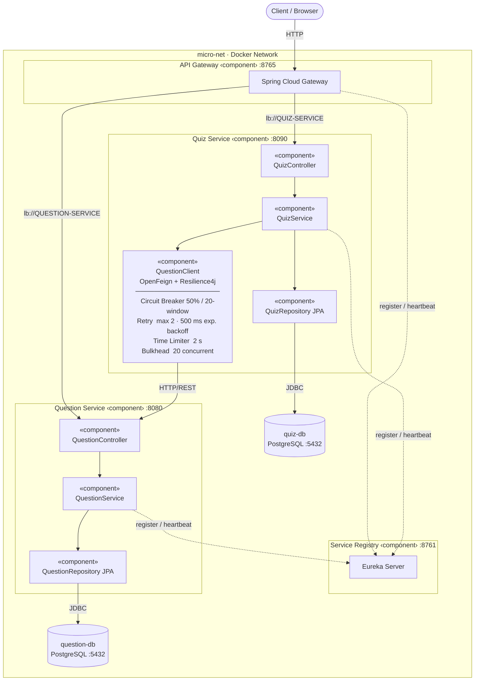
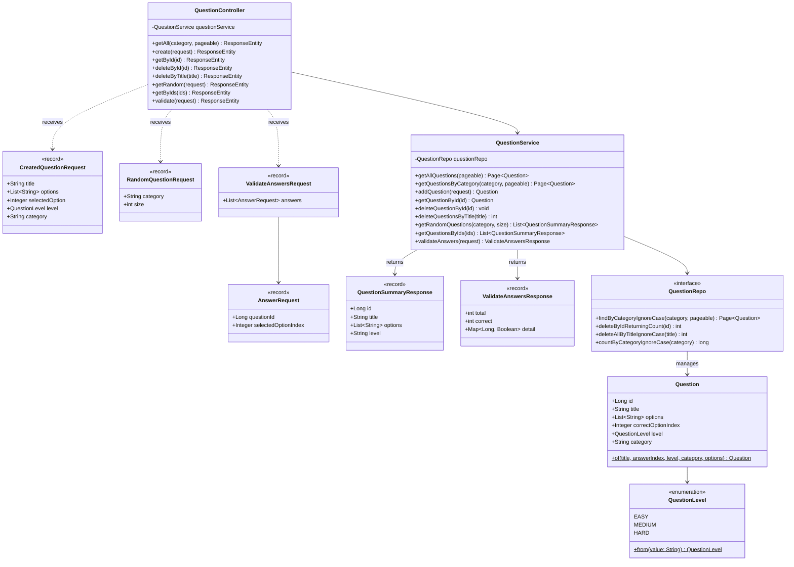
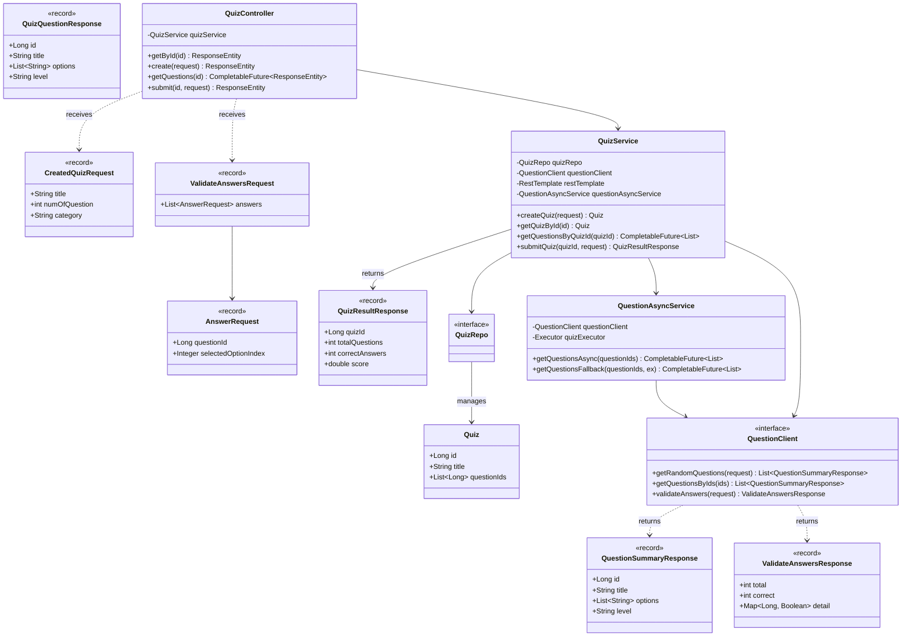
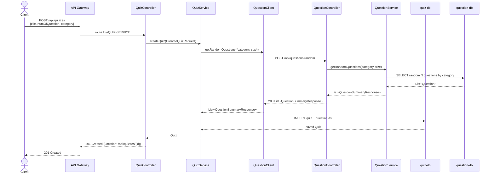
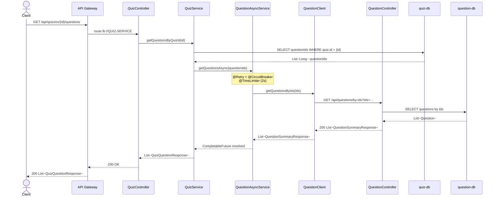
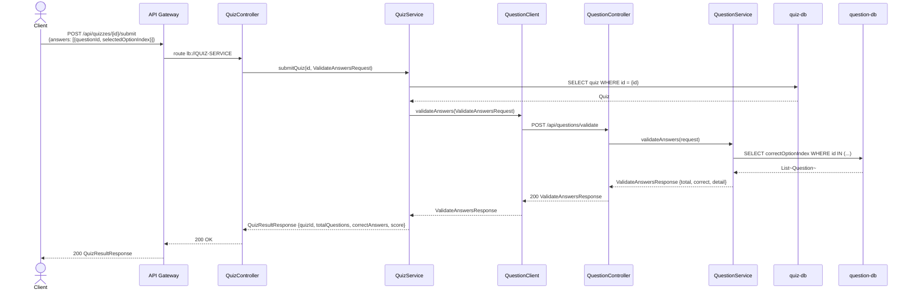
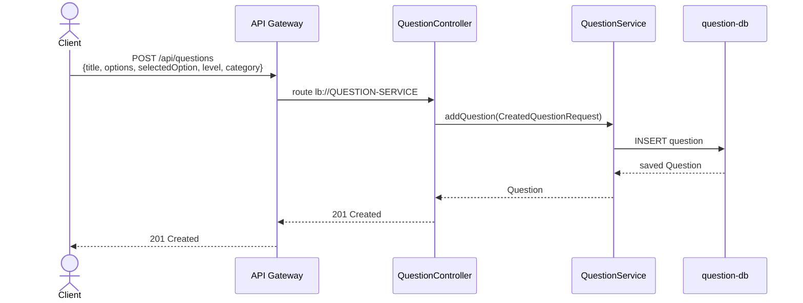
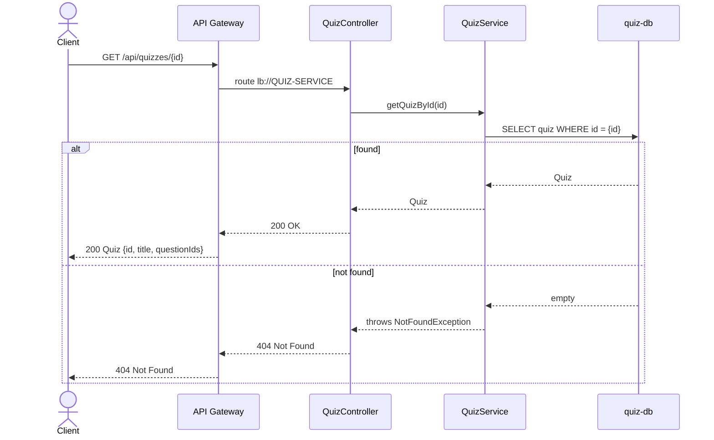
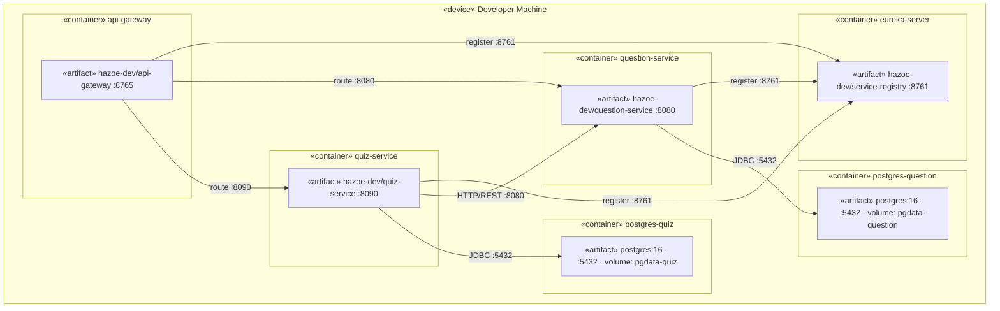
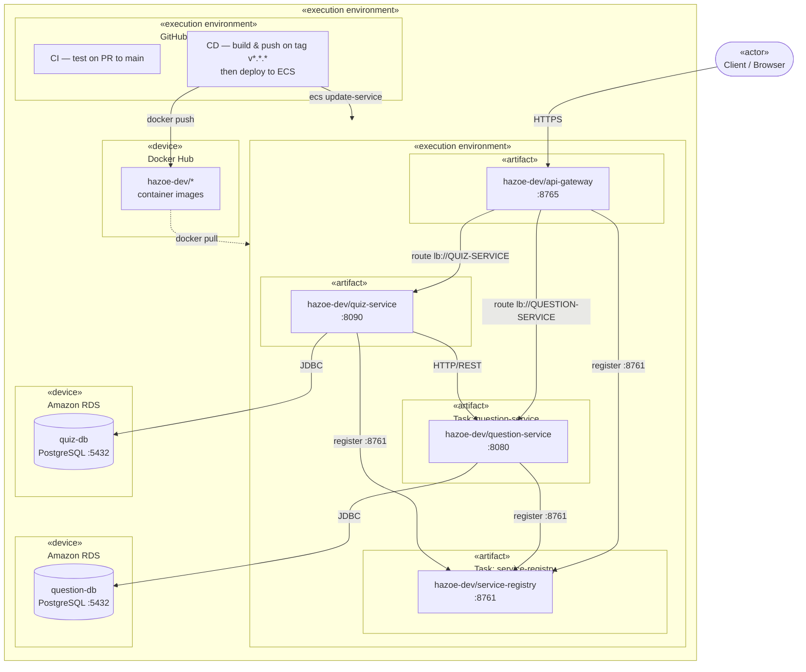

# System Architecture

## Component Diagram

---

## Services

| Service | Port | Technology | Description |
|---|---|---|---|
| Service Registry | 8761 | Spring Cloud Netflix Eureka | Service discovery and registration |
| API Gateway | 8765 | Spring Cloud Gateway | Unified entry point, routing, load balancing |
| Question Service | 8080 | Spring Boot + JPA | Manages questions CRUD, random selection, answer validation |
| Quiz Service | 8090 | Spring Boot + JPA + OpenFeign | Manages quizzes, orchestrates question fetching |

## Infrastructure

| Component | Technology | Details |
|---|---|---|
| Service Discovery | Eureka Server | All services self-register and resolve each other by name |
| Load Balancing | Spring Cloud LoadBalancer | Client-side load balancing via Eureka registry |
| Inter-service HTTP | OpenFeign + RestTemplate | Quiz Service calls Question Service |
| Fault Tolerance | Resilience4j | Circuit Breaker, Retry, Time Limiter, Bulkhead |
| Databases | PostgreSQL 16 | One dedicated database instance per service |
| Containerization | Docker + Docker Compose | All services run in `micro-net` bridge network |
| CI/CD | GitHub Actions | CI on PR to main; CD deploys to AWS ECS Fargate on version tag |

---

## Class Diagrams

### Question Service

### Quiz Service

---

## Sequence Diagrams

### POST /api/quizzes — Create Quiz

### GET /api/quizzes/{id}/questions — Get Quiz Questions

### POST /api/quizzes/{id}/submit — Submit Quiz

### POST /api/questions — Create Question

### GET /api/quizzes/{id} — Get Quiz by ID (with Resilience4j fallback)

---

## Deployment Diagrams

### Local — Docker Compose

### Production — AWS ECS Fargate

---

## Technology Stack

| Layer | Technology |
|---|---|
| Language | Java 25 |
| Framework | Spring Boot 4.0.2 |
| Build | Gradle |
| Service Discovery | Spring Cloud Netflix Eureka |
| API Gateway | Spring Cloud Gateway (WebMVC) |
| Service Client | OpenFeign, RestTemplate (LoadBalanced) |
| Fault Tolerance | Resilience4j |
| ORM | JPA / Hibernate |
| Connection Pool | HikariCP (max 30, min 10 idle) |
| Database | PostgreSQL 16 |
| Async | CompletableFuture, custom 30-thread Executor |
| Container | Docker |
| Orchestration (local) | Docker Compose |
| Orchestration (prod) | AWS ECS Fargate |
| CI/CD | GitHub Actions |
